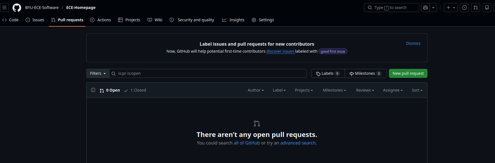

# ECE-Homepage
Homepage site for ECE written in Next to replace brightspot


# Setup instructions:
Please follow the instructions in order for first-time setup.
### 1. Setting up the dev environment:
Start by cloning the repository on your machine using 
```
git clone https://github.com/BYU-ECE-Software/ECE-Homepage.git
```
Then create and switch to a new branch:
```
git checkout -b <firstnamelastname/description>
```

### 2. Install necessary packages
Web dev uses the npm package manager. Dependencies for this project are defined in the package.json file. To install them, run 
```
npm i
```
This will install all the packages into the node_modules folder (which is git-ignored). This means that it's not necessary to make a environment (as when working in python), because all the dependencies are contained within the project folder.

### 3. Host the website locally
To view the website on your local machine, run 
```
npm run dev
```

Changes you make should automatically show up in the locally hosted version.

### 4. Stay updated
To keep the most recent version of main in your dev branch, periodically run
```
git merge origin main
```
This will merge any changes from main into your branch so you're working on the latest version.

### 5. Pull requests
Once you have something that's ready to go into main, submit a pull request via github.
First, add your changed files using 
```
git add .
```
Then commit your changes using 
```
git commit -m "Message describing your changes here"
```
Finally, push your changes to your remote branch using 
```
git push
```
The first time you do this, you may need to run `git push --set-upstream origin <branchname>` to set the romote branch. If you are prompted for OAuth, try signing in and out of github on VScode or your editor of choice.

Then, from the github page, open a new pull request. 

> Make sure to tag Roman by assigning the pull request to him. This will make sure that he is notified of you pull request.


# Editing the website:
Most of the website data in contained within the `app` folder. This directory's structure mimics the website's page structure. To make edits to a page, find or create that page's directory and edit the .tsx file. 

### Helpful keywords for LLMs:
- NextJS - The framework the website is written in
- TailwindCSS - The styling method we're using
- Components - Reproducible building blocks that go on the web page
